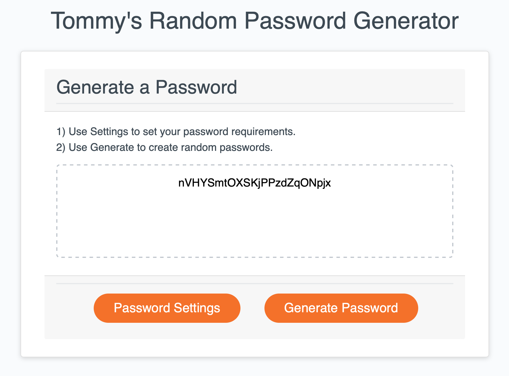

# SMU-Homework-03-Password-Generator

Create a password generator using JavaScript. I made a few tweaks to the initial frame provided, mainly in my use of a dedicated settings button. This allows for better organization of the data gathering portion, as well as the ability to much more quickly generate passwords allowing the user to choose one he/she likes. I also changed the colors. :)

## Description

Our third homework assignment was to create a random password generator tool. A basic set of HTML, CSS and JS pages were supplied. You can skip straight to the final product by clicking [here](https://djfriar.github.io/SMU-Homework-03-Password-Generator/).

For full details on the assignment, please [view the assignment](ASSIGNMENT.md).

## Installation

This site is a standard HTML, CSS, and JS site. To install you can clone the repo and then double-click on index.html.

## Usage

## Credits

- Logical AND: [MDN Web Docs](https://developer.mozilla.org/en-US/docs/Web/JavaScript/Reference/Operators/Logical_AND)
- JavaSCript DOM Handling: [W3Schools.com](https://www.w3schools.com/js/js_htmldom_eventlistener.asp)
- Generating Random Passwords in JS: [GeeksforGeeks](https://www.geeksforgeeks.org/how-to-generate-a-random-password-using-javascript/)

## License

This content can be reused for personal educational purposes only. No commerical use is authorized.
